# Intro

In AHB(-lite), there are two types of components: **master**s and **slave**s.
The AMBA5 version of the protocol family uses *Manager* and *Subordinate* terms,
but our main reference document is [ARM-AHB-Lite], so we stick in CMEmu to the old terms.
The master is active and initiates transfers.
A slave is only reactive -- it reacts to master's requests.
For performance reasons (i.e. reducing the critical path), the reaction is in the next cycle after the request.

TODO:

* what macros do

## Ports

The basic build blocks of this module are **ports**. Like real life seaports, a city (e.g. Gdańsk, Barcelona) has
a dedicated region that could send and receive cargo on ships. This region is usually on some natural boundary.

Here we have two kinds of ports: **MasterPorts** and **SlavePorts**.
A *struct* has/is a port, if it implements some interfaces.
`AHBMasterPortInput` is an interface called to *receive* and process messages (ships) from a slave,
while `AHBMasterPortOutput` is used by the internals of the struct to *send* a message to the slave.
Similarly for `AHBSlavePortInput` and `AHBSlavePortOutput`.

While `AHB*PortInput` is usually implemented in the struct's module,
`AHB*PortOutput` forms a dependency-injection layer and is implemented by (external) routing mechanisms,
to connect the ports in a way decoupled from the ends.
For this to work reasonably, a root `AHBPortConfig` trait is introduced, which for each port dictates:

- type of the payload `Data`  (by default this is `DataBus`, has to be `'static`)
- the `Component` that the port belongs to
- a `&'static str` name used in logging messages and tracing

We've said that a *struct* may **be** or may **have** a port.
This is just a way of describing those ideas:

- a *(sub)component* may implement these traits -- since it is doing multiple things,
  this is just a part of it -- it * *has** a port, but
- often a *unit struct* is created solely as the implementor of those traits (it **is** the port):
  most commonly due to a need for multiple ports for a *(sub)component*.

It is typical to find multiple ports within a single simple component:
we use this free abstraction e.g. for delegation or encapsulation (hiding internal names).
This allows the external router to stick with a stable exported name,
while the actual implementation is properly sealed.

In summary, the following diagram present where those traits are implemented.

```mermaid
graph LR
    subgraph S[Slave.rs]
        SC[impl AHBPortConfig for Slave]
        SI[impl AHBSlavePortInput for Slave]
        SL((Logic))
    end
    subgraph M[Master.rs]
        MC[impl AHBPortConfig for Master]
        MI[impl AHBMasterPortInput for Master]
        ML((Logic))
    end
    subgraph IC[Routing_layer.rs]
        MO[impl AHBMasterPortOutput for Master]
        SO[impl AHBSlavePortOutput for Slave]
    end
    ML ==> MO
    MO -.-> SI
    SL ==> SO
    SO -.-> MI
```



### Routing with `bridge_ports!`

Tbe `bridge_ports!` macro generates the boilerplate `impls` of `AHB*PortOutput` by delegating to
the corresponding `AHB*PortInput` (both ways).
In general, in can delegate any `AHB*Port*` interface in terms of another one with matching input types:
master-to-slave-wires or slave-to-master-wires.

The simplest call like this:

> bridge_ports!(*@master* **Master** => *@slave* **Slave**);

would generate the following.
(Note: the `@master`/`@slave` markers are the default and may be skipped is the above configuration.)


Adding ``@auto_configured`` on one side would generate: (for ``@auto_configured @slave Slave``)


There are four possible combinations of the markers.
The remaining are used to handle and reroute inputs.

> bridge_ports!(*@master* **Master** => *@master* **OtherMaster**);
>
> bridge_ports!(*@slave* **OtherSlave** => *@slave* **Slave**);

is useful to delegate input of an exposed port marker to an internal port, thus keeping a stable API.
For example, the first generates:


Finally, we may convert a slave input into a master output.
As a special case, when applied to the same struct,
it would build a pass-through implementation that does nothing besides logging.

> bridge_ports!(*@slave* **Slave** => *@master* **Master**);


### Routing example

The following example shows how a chain of port bridging might look like.
Each macro may be substituted with some actual implementation if extra logic is necessary.

In this example we have a `Master` port-struct, that uses a facade `PublicMaster` port-marker-struct.
The routing layers between components may involve interconnections:
a component that has both slave ports and master ports.
Such an interconnect layer may have a facade `PublicICSlave`, that should forward calls to `ICSlave` port.
Typically, there would be some logic implemented at this point that eventually would present a request on the
interconnect's output.
But, perhaps, at the current stage of implementation, no logic is required.
If so, we might want to just forward the message to interconnect's `ICOutMaster`.
Finally, since the existence of the interconnect is transparent,
we could connect `ICOutMaster` to `Slave` in the same way,
as we would do with just a direct `Master->Slave` connection.


it results in the following flow:


### Extra options

Additional markers supported by the `bridge_ports!` macro include:

- **@no_m2s**: don't generate the left-call-right impl
- **@no_s2m**: don't generate the right-call-left impl
- **@no_link**: don't generate any calls (useful when used with `@auto_configure` to just copy it)
- **@proxied @master**, **@proxied @slave**: would generate calls to `AHB*PortProxiedInput` instead of `AHB*PortInput`.

Moreover, a syntax for generic components is supported like so:
`bridge_ports!(<`**TYPE_VARS**`>: normal_call_presented_above where `**WHERE_BLOCK**`)`
These type variables and the where block will be copied to all generated `impl`s.
Refer to the macro documentation for more details.

## Signals

TODO: *Wires etc.

### DataBus

`DataBus` is a simple enum abstraction over various AHB bus widths and transfer sizes.
Instead of placing the data is some nontrivial bytes of the data bus representation as `[u8; X]`,
we just use enum encoding the size of the data.
This struct has a lot of useful methods to manipulate carried data,
like changing an addressed byte inside a stored word.

### Naming convention

#### Naming of sides

In a component, that has both slave and master ports the nomenclature may be confusing.
Here we use the following convention:

The request comes from the side, which we (as in the documentation for a given module) may call:

- (our) slave port
- our master
- upstream

The request is sent to/through:

- (our) master port
- (our) slave
- downstream

Think about it like this: *We use the slave port to communicate with our master in order to forward the messages
upstream*.
This is why interconnects call *slave ports* the interfaces to communicate with the Masters.
Conversely, the *master port* is not used to communicate with the master, but with the Slaves
-- from its perspective we're the master.
Slave ports may be found suffixed with `S`, while master ports with `M`.

# Basic serialization assumptions for AHB-lite in CMEMu

Those assumptions are there for an optimization to prevent propagating signals when idle,
while allowing for a proper transition of module's state machines.

1. All AHB-Lite wires in the same direction between two given ports are always sent in the same time.
2. If a **Master** sends a message over a connection, the **Slave** must send a response message in *the next cycle*,
   except for data-phase response to NoSel.
3. If a read/write transfer is in data phase, **Master** must always send a message. Even for reads.
4. A lack of message is equivalent to NoSel (Idle in direct AHB-Lite with no decoder).
5. If a **Master** doesn't expect a message from a **Slave**, it can assume *Success* response without waiting for it.
   The **Slave** is allowed to send that *Success* message anyway, which must be then ignored by the **Master**.

The following is a requirement for an outer-facing module.
Some tightly integrated parts may use the AHB infrastructure internally without following the assumptions.
An example of this is interconnect, of which outer ports follow those assumptions,
but internally *InputStage* for instance, breaks 2.

To reiterate: from **1.** it stands that duplicate messages between the same endpoints are strictly disallowed.

Reasoning for **3.**: this resolves the question "did master generate IDLE or we haven't received the message yet?".
Moreover, it simplified propagation of the HREADY signal.

# Drivers / Interfaces

The slave/master drivers are intended to simplify implementing endpoints of the AHB communication: components that
generate requests (**masters**) and components, which are the receivers of the requests, replying to them (**slaves**).

The simplification stems from allowing only sequential logic,
thus preventing from leaking information that would create a too long critical path in the silicon.

For each clock cycle, those drivers operate in two phases:

* `tick`
    * the *component* may ask the *driver* to do something
    * the *driver* may provide a delayed update from the previous cycle (e.g. deliver data)
* `tock`
    * the *driver*s communicate with each other
    * the *driver* may combinationally provide data to the *component*.

This approach makes it impossible to (accidentally) make a request in the same cycle in which the response was
received (over AHB).

## Writing slaves / masters

In order to write a component with a driver, you have to:

* make a slave or master port **P** with visibility outside the module (see intro)
* insert the driver as a subcomponent - this type is also a port
* route input to the driver (e.g. with `bridge_ports!`)
* implement a handling trait on your port **P**

The handlers and drivers come in various flavours,
and some traits may be automatically implemented from a simpler trait.
As a rule, choose a single handler trait to implement.

### Replies

The AHB reply is simplified and handles error states automatically. It can only be:

* Success(data) = reply with HREADY + OKAY and (optional) data on the bus {unit is used for writes}.
* Pending = reply with low HREADY + OKAY – the handler will be called again in the next cycle with same data.
* Error = reply with low HREADY + ERROR - the rest is handled automatically with accordance to the protocol.

### Slave driver handlers

Trough configuration it may be selected, whether the requests should be presented synchronously
(as they come in `tock`) or asynchronously (in the following `tick`).
By default, reads are delivered in the following cycle (same as the data phase),
because it could simply return up-to-date values from the registers.
Conversely, for writes data phase is delivered synchronously to allow writing such values to registers.

The slave driver should be interacted mostly through return values of the handling callbacks.
A typical handler would have to implement the following methods:

* `read_data(address, size) -> reply<data>`
  a read-type request has came, and the returned reply will be sent at appropriate time.
* `pre_write(address, size) -> reply`
  according to the protocol, the slave has to decide on wait-stating prior to the data phase.
  By default, it is also delivered asynchronously (in `tick`) like reads. It is called only once per transfer.
* `write_data(address, size, data, post_success) -> reply`
  This callback delivers the data-phase value from the data bus.
  By default, it is called synchronously in `tock`.
  Because the reply had to be decided in `tick` phase, what we return here is the status for the next cycle.
  In the case that `Success` was sent in `tick`, the `post_success == true` and there is no following data-phase cycle.
  The handler is called nonetheless, because it could be the first, and only, data-phase cycle.
  (Or we may want to sample the data in the last cycle of the transfer).

#### Potential issues

Remember, that in synchronous `write_data` you are in the `tock` phase and cannot ask the driver for anything
(e.g. call methods).

Sometimes interaction has to be delayed like in:
```tock => write_data(...) - cannot interract w/ driver => | tick => can do here```

Note: If you wish to implement a component, that acts both as a slave, and a master,
that is supposed to receive a request, mutate it, and forward it to the master port **during a single cycle**,
then this *cannot* be implemented with drivers.
You would need to implement a combinatorial component.

## Visualisation

The following sequence diagram shows a case when the master issues a `read` request and a `write` request in the
following cycle.
The `read` request is waitstated by the slave.
The bus is initially idle.


# Advanced traits

This section explains how component-boundary is handled and how to tunnel multiple ports through a single function --
like VLANs.

TODO: dual-nature enum-variant-unit-struct things


