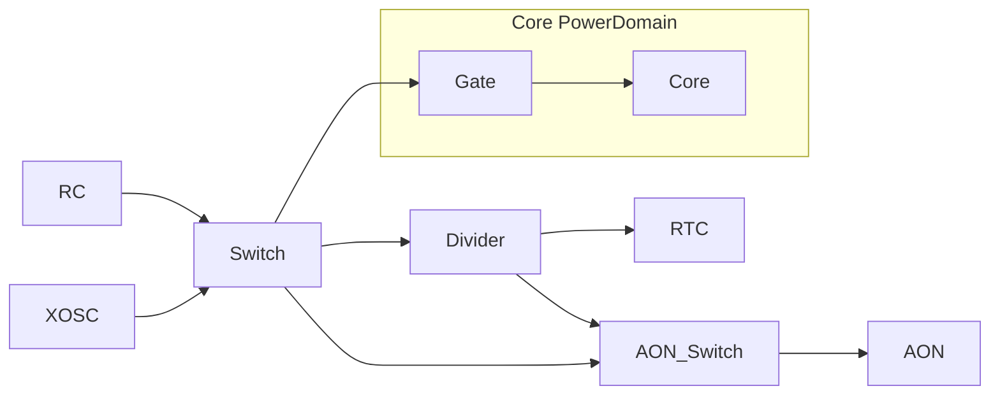
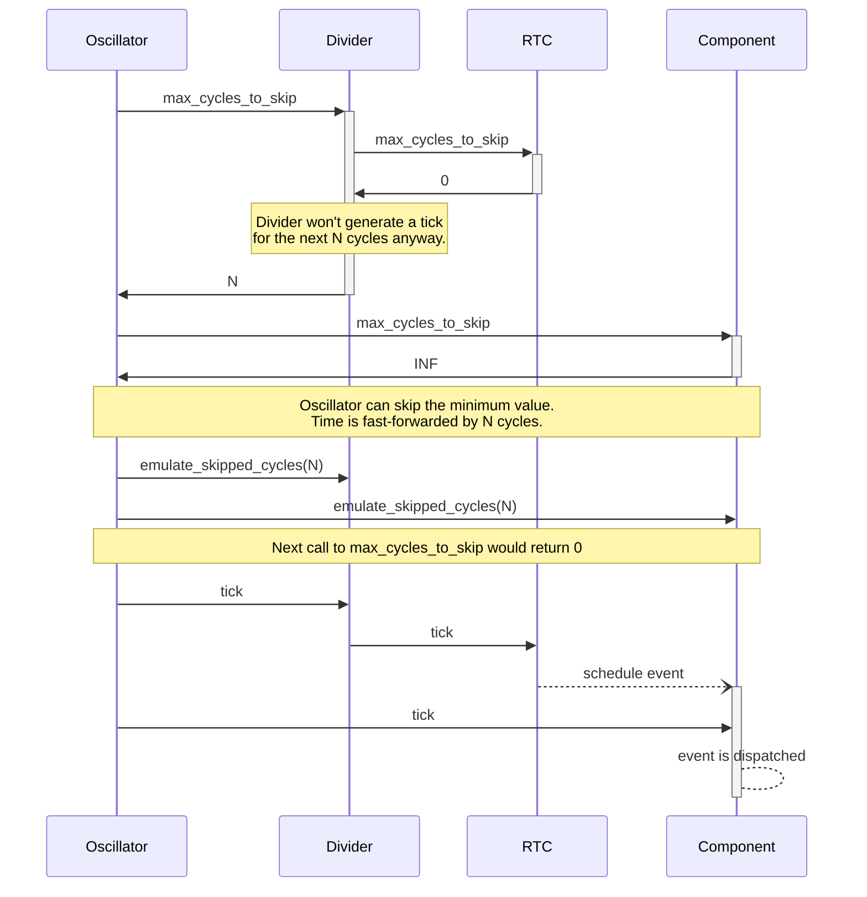
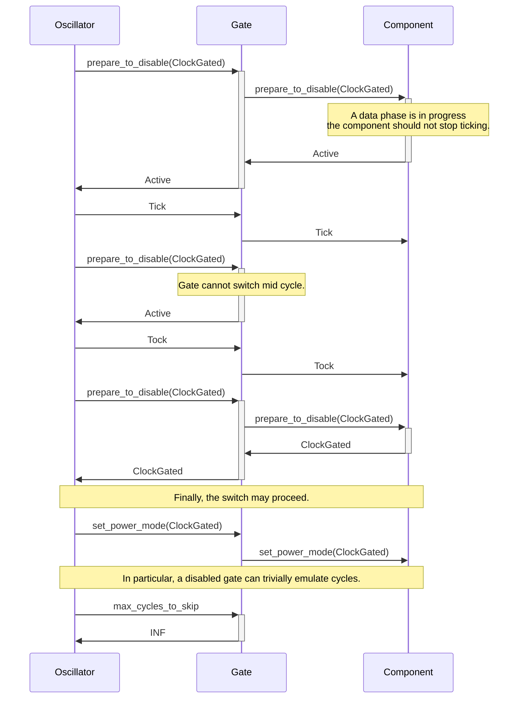

# Clock and Power in CMEmu

This module contains a framework for simulating clock and power lines in CMEmu.
While CMEmu is mostly message-passing oriented, this module has direct access to components and can
directly call trait-methods on them.

The principial operation is calling simulated clock edge handlers `tick()` and `tock()` on all components.
You may think about them like `@posedge` and `@negedge` in VHDL, enabling simulation of two-phase-clock designs.
However, in CMEmu their main focus is correctness: the `tock()` event may happen only after all immediate events
spawned by `tick()` are fully processed.
All `tick()` handles for a given clock are called "atomically", that is before any new event may be delivered.

If you look at any microcontroller's reference documentation, you will find the clocks actually form a tree structure
(a DAG, in fact) with various kinds of nodes:

- **Oscillators** are the roots of the clock signal (usually built-in RC-oscillators and external "XOSC" quartz
  oscillators),
- **Gates**, which sever the clock line based on a configuration,
- **Switches** selecting one of multiple input clock lines,
- **Dividers** generating slower clock lines (simply by counting),
- **Phase Locked Loops (PLL)**/**Multipliers**, which are active parts to generate a new clock signal that may be faster
  than the input.

Furthermore, power subsystem is very close to the clocks.
Typically, you may find a component to be in one of four energy states (represented in cmemu with `engine::PowerMode`):

- **Active**
- **ClockGated** – the clock line is not ticking – i.e., state cannot evolve, but data may still flow through set
  transistors,
- **Retention** - most power lines are cut off, but configuration is preserved,
- **Off** – losing all state

These states are sometimes called "shallow sleep", "deep sleep", and "shutdown", but the precise definitions vary.
(A bit of theory: in digital systems, most of the power is lost by transistors switching state: it is called "dynamic
power", while keeping a digital state uses very little "static power" (often in a form of *leakage*).)

Right now, we don't implement lower power states than ClockGated – that is, we pretend they don't do anything more.
Keep in mind, that "power domains" in CC2650 have an implicit clock gate associated to them – these may look confusingly
named in the codebase.



## Clock concepts and invariants

At the root of the clocks design is a concept of a cycle.
In typical circumstances, this means periodic calls to `tick()` and `tock()` which constitute a single cycle.
As a core invariant, we require that **a `tick` is always paired with a `tock`**.
(For instance, it should not be broken by a *gate*, which stopped forwarding events after `tick` and before `tock`.
This is somewhat similar to clock glitches.)

However, not every cycle has to be `tick-tock` stepped.
The design allows a component to simulate multiple cycles at once (always from "post tock" state to another "post tock")
— we call it **cycle skipping**.
In isolation, a component could just report how many cycles it can skip without tick-tock stepping.
But, this value usually also depends on external events, which may come to the component
— we need the component to reevaluate its decision once an event happen.

Therefore, in our design of *cycle skipping*, events play a central role.
A node is asked with `max_cycles_to_skip` for the number of cycles it can skip (cycle-exactly)
**without generating an event**.
This puts an **upper bound** of the number of skipped cycles, which are simulated by calling `emulate_skipped_cycles`.
(In particular, this method **must not** generate any events yet).
As a consequence, in a synchronous[^1] system, an event will only be delivered once the component had a chance
to update its state to reflect the skipped cycles.

To see how it works in practice, let's take a look at an example in which a timer (RTC) is behind a divider.
The timer is going to generate an event on the next cycle.
As shown, if `max_cycles_to_skip` returns `0`, the node is guaranteed to be `tick-tock` stepped,
and it can generate an event there.
`emulate_skipped_cycles` is usually not called for `0`.

[^1]: (that is, derived from the same clock)



### Power state switching

As mentioned above, a gate should not switch its state between `tick` and `tock`.
Thus, we need another facility for doing "ask-commit" procedures regarding the power state.
A method `prepare_to_disable(power_mode)` is called on a clock/power subsystem node to indicate an intention
to switch the power state of that node (usually as a consequence of a switch of another node).
On a clock line, turning off a gate would represent transitioning from an `Active` power mode to a `ClockGated` mode.
Similarly to the clock skipping, the method should return the closest allowable state to the requested one.
The "commit" is done by `set_power_state(new_mode)` – we couldn't do it simply in the request method,
as siblings in the graph could return different values.

This ask-commit procedure is analogous to request-acknowledge lines in the simulated system,
but simulating them is not the main goal: as previously, emulator correctness is.
For instance, our invariants of the memory system (ahb) require generating events each cycle during the *data phase*.
On the other hand, turning off gates has a strong interplay with skipping cycles, as they can skip any number,
since they're not passing ticks anymore.
This is exemplified on the example flow below:



### State management

Apart from calling the above methods and preserving invariants, the clock-and-power framework is not responsible
for deciding what state a node **should be**.
This logic should be implemented in per-microcontroller components (representing the physical state machines).
These components should request the state change by sending events such as: `want_node_state`, `want_switch_parent`,
`want_divider_scale`, `start/stop_oscillator`, `start/stop_sleep`.
The last pair is used to enable/disable the logic of skipping cycles.

The change is not intermediate, but rather remembered for a node (`set_next` method)
and attempted periodically with the `try_apply_next` method.

## Clock DAG implementation

In our implementation, the clock graph is represented statically on the type level: each *component*,
clock graph *node*, and *oscillator*
is a separate **type** with (trait-) methods for operations such as indicating a `tick` event.
This design is the same as in the rest of the emulator, where we want to enable as much compiler optimizations as
possible.
In particular, the traits may look similar to some of the `ahb` memory buses, and links between nodes are generated by a
build-script.

While events in CMEmu are time based (from the event queue), let's focus first on the digital signal propagation.
(The timing is based on scheduling, described later.)

In the clock graph code you'll find two "levels" of nodes for the graph:

- **base nodes** are the one implementing the core node logic: for instance, a base divider (`nodes::Divider`) just
  counts ticks, and tells if a `tick` should pass to children,
- **graph node** is a (generic) type implementing its part in the graph: e.g., the `tick()` method of `DividerNode<SC>`
  should decide and call the `tick()` methods of children nodes in the graph.

Because the nodes differ only by configuration and children nodes, they are implemented as generic types
over a `Subcomponent` marker type (which is used to project the whole-graph reference to a node reference).
The actual calls to children nodes are encapsulated in the build-script generated code.

### The traits

Our code is built around defined traits rather than just calling methods by convention
(even though impl bounds are seldom used).
`EnergyNode` is the base trait defining types shared across a graph: `IdSpace` is an enum identifying a node.
In the main graph, we use `build_data::EnergyEntity` generated by the build script.
Moreover, all the traits also require implementing `Subcomponent`.

The tick-tock stepping trait has two methods like:

```rust 
fn tick(
    comp: &mut <Self as Subcomponent>::Component,
    ctx: &mut Context,
    parent: <Self as EnergyNode>::IdSpace,
    extra: &mut <Self as EnergyNode>::Extra,
);
```

We use `Subcomponent::Component` as the first argument, as it allows the inner clock graph nodes to be implemented
as fields (subcomponents) of the clock manager (as fields of a structure representing the whole graph).
Using `Subcomponent`, lets us have a DAG, so a node can call methods on sibling subfields of the structure,
therefore enabling static representation of the graph.
This integrates well with the leaf components, as each `MainComponent` implements `Subcomponent` as well.

The parent argument represent the node making the call: it is mainly needed for switches,
which are implemented as accepting multiple calls, for instance to `tick`, but passing only the one with matching
`parent`.
The `extra` field is required to uniformly handle internal nodes (e.g., gates) and leaf components receiving the
signals.
This is done by the internal nodes passing a reference to all components through this field.

### Generated graph

The clock graph is described in `cmemu_build_conf.yaml`, where each node has specified its type and parent nodes.
As the graph nodes are implemented as generic types (over the subcomponent marker),
the actual relationship between nodes is decoupled by delegating a trait implementation to the generated code.
We use another generic trait for that: `RPITITNode<Call, RetVal>` (Return Position Implement Trait in Trait Node)
with a `map_children` method,
whose implementation should iterate over all children of the given node, calling a method identified by `Call`,
and collecting return values of `RetVal` type.
For instance, if we had a graph node represented by type `CoreGate` (independent of what is the actual type),
`impl RPITITNode<PrepareMapper, PowerMode> for CoreGate` would iterate and call `prepare_to_disable(arg)`
on the children nodes.

This approach allows us to write generic code in the style of (simplified):

```rust
impl SkippableClockTreeNode for GateNode<SC>
where
    SC: Subcomponent<Member=Self>,
// Implementation is delegated    
    Self: RPITITNode<MaxSkipMapper, u64> + RPITITNode<EmulateMapper, ()>,
// ...
{
    fn max_cycles_to_skip(comp: &mut SC::Component, /*...*/) -> u64 {
        if Self::passes(comp) {
            // Iterator calling SkippableClockTreeNode::max_cycles_to_skip on all children
            <Self as RPITITNode<MaxSkipMapper, u64>>::map_children(comp, /*...*/).min()
        } else {
            u64::MAX
        }
    }
    // ...
}
```

and generating code like:

```rust
#[derive(Subcomponent, ...)]
struct Graph {
    #[subcomponent(CoreGateSC)]
    core_gate: GateNode<CoreGateSC>,
    // ...
}
type CoreGate = GateNode<CoreGateSC>; // Alias, but generating for a given parametrized type
// MaxSkipMapper here acts just as a marker, but it may pass some extra arguments.
impl RPITITNode<MaxSkipMapper, u64> for CoreGate {
    fn map_children(comp: &mut Graph, /*...*/) -> impl Iterator<Item=u64> {
        [
            <CPU as SkippableClockTreeNode>::max_cycles_to_skip(comp, /*...*/),
            // … other children nodes
        ].iter()
    }
}
```

## Scheduling

The clocks framework is not calling the `tick` or `max_cycles_to_skip` methods directly.
Instead, these are called by *oscillators*, which implement a time-based API and participate in **scheduling**.
Such an oscillator could simply multiply the cycles by a duration, or simulate a realistic clock
with drift, jitter, and other phenomena.

The API has 3 main methods:

- `pulse` is the main periodic method returning a delay to the next pulse; internally, it calls `tick` and `tock`s,
- `max_time_to_skip` returning `Option<Duration>`; internally based on `max_cycles_to_skip`,
- `fast_forward_time` returning delay to the next `pulse`; internally dispatching to `emulate_skipped_cycles` (must be
  consistent with the above).

The skipping methods have similar invariants to the cycle-level methods, but concern asynchronous events.
All the methods return time, with `pulse` and `fast_forward_time` returning time of the next impulse,
while returning `Some` from `max_time_to_skip` prevents calls to `pulse`.
If `OscA::pulse` generated an event to a component driven by `OscB`, we should update its time
with `OscB::fast_forward_time` before delivering the event.

Right now, we have no facilities of determining what Oscillators are affected, therefore we preempt the "skip" of
all of them.
Thus, if one oscillator is pulsing (tick-tock stepping) and the other is sleeping (skipping),
the other will be repeatedly "woken up from sleep" with `fast_forward_time` to reevaluate `max_time_to_skip`
at the next `pulse` time.
